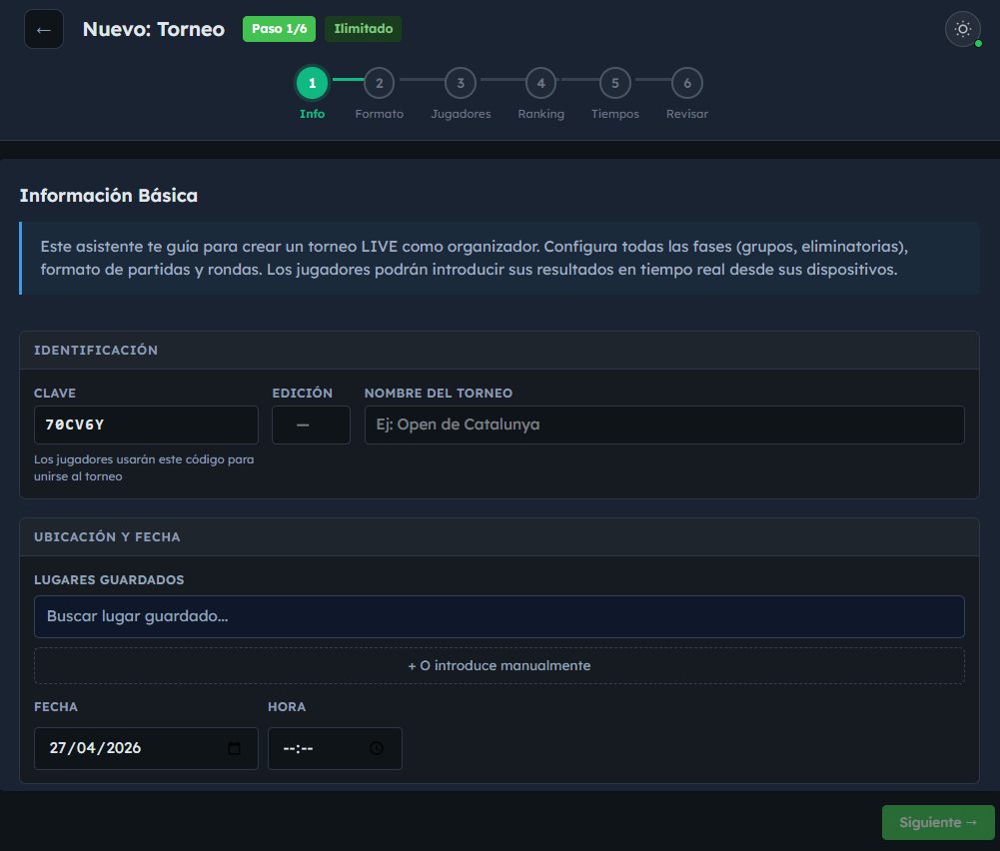
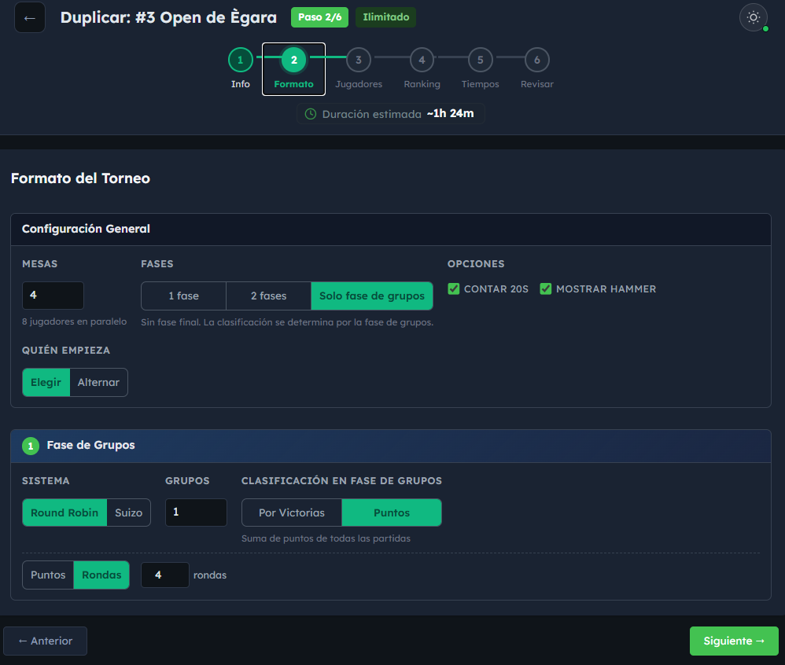
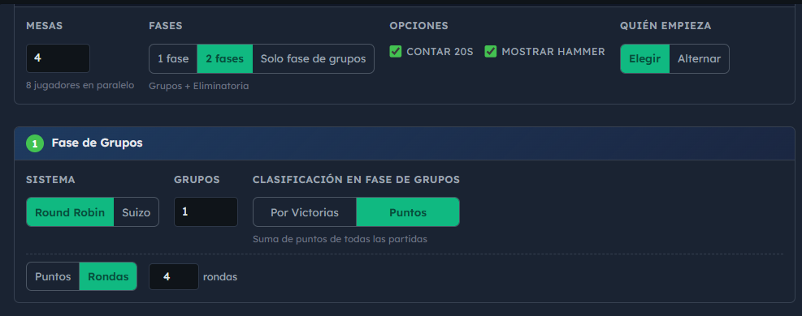
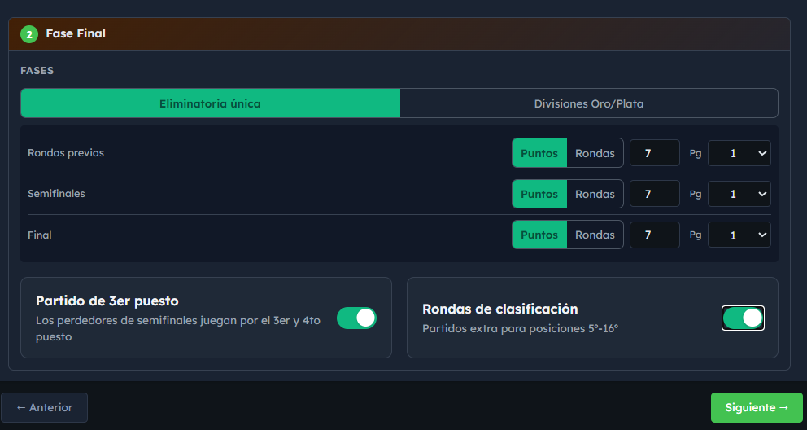
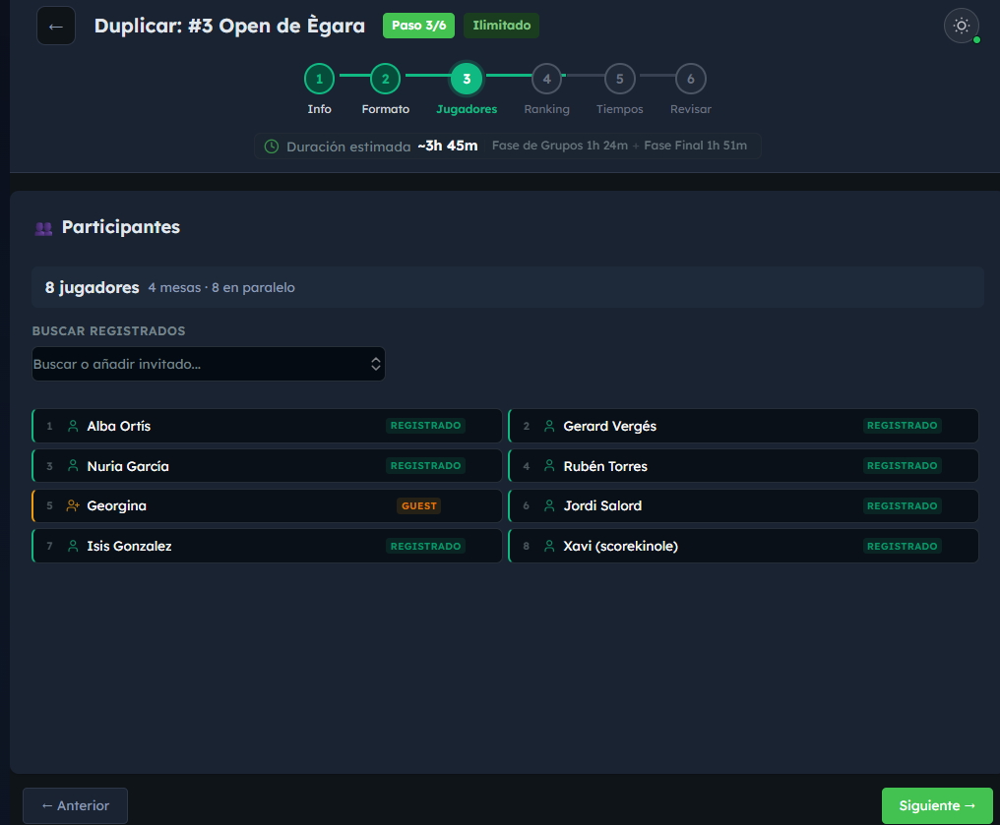
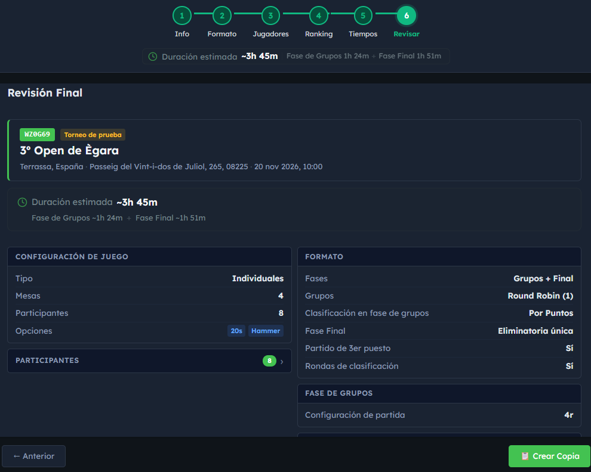
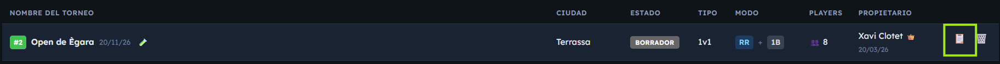
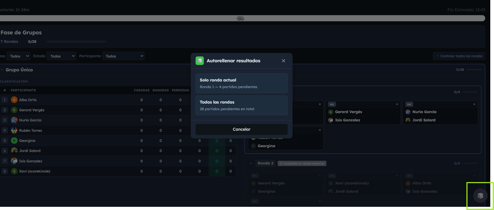

# Guía para Admins: Crear un Torneo en directo

Guía paso a paso para administradores **sin conocimientos técnicos**. Te explica cómo crear un torneo en directo, qué significa cada opción y para qué sirven los botones especiales como **Duplicar torneo** y **Autorellenar partidos**.

> ¿Qué es un torneo "en directo"? Es un torneo que **gestionas en tiempo real desde la app**: vas registrando resultados, la app empareja jugadores, calcula la clasificación y gestiona el cuadro final automáticamente. Es lo opuesto a un torneo "importado" (donde solo subes resultados ya jugados). En la app y en otros documentos lo verás también como *"torneo LIVE"* — es el mismo concepto.

---

## Antes de empezar: conceptos básicos

Antes de tocar nada, conviene entender **3 conceptos clave** que aparecerán en el formulario:

### 1. Sistema de juego: Round Robin vs. Suizo

Son las dos formas de organizar la **fase de grupos**. La diferencia es importante:

| Sistema | Cómo funciona | Cuándo usarlo |
|---------|---------------|---------------|
| **Round Robin** (Liguilla) | Todos juegan contra todos dentro de su grupo. Si hay 6 jugadores, cada uno juega 5 partidos. | Grupos pequeños (≤8 jugadores). Es lo más justo: todo el mundo se enfrenta a todo el mundo. |
| **Suizo** | Cada ronda empareja a los jugadores con **puntuación parecida** (los que ganan se enfrentan a otros que ganan). NO juegan todos contra todos. | Grupos grandes (15-50+ jugadores) donde hacer Round Robin sería eterno. Tú decides cuántas rondas se juegan (típico: 5-7). |

**Regla rápida**:
- ¿Pocos jugadores? → **Round Robin**
- ¿Muchos jugadores? → **Suizo**

### 2. Estructura de fases

En el formulario verás un selector llamado **"Fases"** con 3 opciones:

| Opción del formulario | Qué incluye | Ejemplo |
|-----------------------|-------------|---------|
| **2 fases** (recomendado) — *Grupos + Eliminatoria* | Fase de grupos **+** cuadro final eliminatorio | Mundial de fútbol: primero grupos, luego octavos/cuartos/etc. |
| **Solo fase de grupos** | Solo fase de grupos, sin eliminatorias. La clasificación se determina por la fase de grupos. | Una liga corta donde gana el primero del grupo. |
| **1 fase** — *Eliminatoria directa* | Solo eliminatorias directas, sin fase de grupos | Tipo Wimbledon: pierdes y fuera. |

**Si dudas, elige "2 fases".** Es lo más habitual.

### 3. Modo de puntuación: Puntos vs. Rondas

| Modo | Cómo termina un partido |
|------|-------------------------|
| **Por puntos** | El primero en llegar a X puntos (5, 7, 9 u 11) gana el partido. |
| **Por rondas** | Se juegan exactamente N rondas (4, 6 u 8) y gana quien tenga más puntos al final. |

**Modo "Mejor de" (Best of)**: dentro de un partido, puedes pedir varios juegos. *Best of 3* = el primero que gana 2 juegos se lleva el partido.

---

## Crear un torneo paso a paso

Ve a **Admin → Torneos → Nuevo torneo**. El formulario tiene **6 pasos**. Te los explico uno a uno.

### Paso 1 — Información básica

Es el "DNI" del torneo. Aquí pones quién, cuándo y dónde.



| Campo | Qué poner | ¿Obligatorio? |
|-------|-----------|---------------|
| **Clave del torneo** | Código de 6 caracteres que se genera automáticamente. **Es la "contraseña" que necesitan los jugadores para entrar a jugar sus partidos del torneo desde la app.** No la cambies salvo que sepas lo que haces. ⚠️ Anótala bien y compártela con los participantes el día del torneo (sirve tanto para jugadores registrados como no registrados). | Sí |
| **Nombre** | El que verá la gente. Ej: "Open de Crokinole de Barcelona". | Sí |
| **Edición** | Si es la 3ª edición, pon "3". | No |
| **Descripción** | Texto libre. Puedes ponerlo en español, catalán o inglés. | No |
| **Ubicación** | País, ciudad, dirección, sede. | No |
| **Fecha y hora** | Cuándo se juega. | No |
| **Tipo de juego** | **Singles** (1 vs 1) o **Dobles** (2 vs 2). | Sí |
| **Torneo de prueba** | ✅ Marca esta casilla mientras estés montando o probando el torneo. Hace dos cosas: **(1) oculta el torneo del listado público** (nadie lo verá hasta que tú quieras) y **(2) no cuenta para el ranking general**. Cuando el torneo esté listo y quieras publicarlo, **edita el torneo y desmarca esta casilla** — entonces aparecerá en el listado público y empezará a contar para el ranking. | — |

> 💡 **Flujo recomendado con "Torneo de prueba"**: créalo siempre marcado mientras lo configuras y haces pruebas (incluso con "Autorellenar partidos" si quieres). Así nadie lo ve. Cuando todo esté listo y quieras que aparezca a los jugadores en el listado público, **edita el torneo y desmarca la casilla**. A partir de ese momento será visible y contará para el ranking.

**Sección de inscripciones (opcional)**: si quieres que la gente se apunte sola desde la app, activa "Permitir inscripciones" y configura:
- Fecha límite de inscripción
- Máximo de participantes
- Cuota (texto libre: "Gratis", "10€", etc.)
- Lista de espera (si se llena el cupo)
- Si la lista de inscritos es pública o no

---

### Paso 2 — Formato del torneo

Aquí defines **cómo se juega**. Es el paso más importante.



#### A) Mesas
- **Número de mesas**: cuántas mesas físicas tienes disponibles. La app reparte los partidos automáticamente entre ellas. Si tienes 4 mesas, pon 4.

#### B) Estructura de fases
Elige una de las tres opciones (**"2 fases"** suele ser la mejor).

#### C) Configuración de la fase de grupos *(si aplica)*

- **Sistema**: Round Robin o Suizo (ver explicación arriba).
- **Si elegiste Round Robin**: indica cuántos grupos quieres (1-8). Ej: 24 jugadores en 4 grupos = 6 jugadores por grupo.
- **Si elegiste Suizo**: indica cuántas rondas. **Mínimo 3, recomendado 5-7.**
- **Modo de puntuación**: por puntos o por rondas.
- **Mejor de (Best of)**: cuántos juegos por partido (Best of 1, 2, 3...).
- **Modo de clasificación**:
  - **Por victorias** (tradicional): 2 puntos por ganar, 1 por empatar, 0 por perder.
  - **Por puntos totales**: suma todos los puntos anotados durante la fase.



#### D) Configuración del cuadro final *(si elegiste "2 fases")*

- **Modo de divisiones**:
  - **Cuadro único**: todos los clasificados van al mismo bracket.
  - **Oro y Plata**: los mejores van al cuadro Oro, los siguientes al cuadro Plata.
- **Cuadro de consolación**: cuadro paralelo para los eliminados en primera ronda. Activa si quieres dar más partidos a los que pierden pronto.
- **Partido por el 3er puesto**: activado por defecto.
- **Configuración por fase del cuadro** (rondas iniciales, semifinales, final): puedes poner reglas distintas. Ejemplo: rondas iniciales al mejor de 1, final al mejor de 3.
- **Mínimo de clasificados**: cuántos pasan de la fase de grupos al cuadro (por defecto 8).



#### E) Opciones generales
- **Contar 20s**: si marcas, se cuentan los 20s en cada ronda (relevante para desempates).
- **Mostrar hammer**: indica quién tiene el último tiro.
- **Quién empieza con el hammer**: por sorteo y rotación, o alternando.

---

### Paso 3 — Añadir participantes

Aquí metes a los jugadores. Tres formas:



1. **Añadir manualmente**: escribes el nombre y listo.
2. **Buscar jugadores existentes**: si el jugador ya tiene cuenta, lo encuentras por nombre/email.
3. **Importar desde lista**: pegas una lista de nombres.

**Mínimo: 2 participantes** para poder seguir.

> ⚠️ Si el torneo es de **dobles**, cada "participante" es una pareja. Tendrás que indicar los dos miembros y opcionalmente un nombre de equipo.

---

### Paso 4 — Ranking *(opcional)*

¿Quieres que este torneo dé puntos al ranking general?
- **Si NO**: deja desactivado.
- **Si SÍ**: elige el nivel del torneo (en el formulario aparecen como tarjetas con un badge de color):
  - **Series 15** — *Torneos locales y de clubes* (da pocos puntos).
  - **Series 25** — *Torneos regionales* (puntos intermedios).
  - **Series 35** — *Campeonato de España o torneos masivos* (da más puntos).

La app reparte los puntos automáticamente según la posición final y el número de jugadores.

---

### Paso 5 — Tiempos *(opcional pero útil)*

Sirve para **estimar la duración** del torneo. Tiene doble utilidad:
- **Para ti como admin**: te haces una idea realista de cuánto puede durar todo (fase de grupos + cuadro final), y así puedes planificar horarios, descansos, reservar la sede el tiempo necesario, etc.
- **Para los jugadores**: la app les muestra la duración estimada, así saben a qué atenerse antes de apuntarse.

- **Minutos por cada 4 rondas** (singles vs. dobles): cuánto tarda un bloque de 4 rondas.
- **Promedio de rondas** según el modo de puntos (5pts, 7pts, 9pts, 11pts).
- **Pausa entre partidos**: minutos de descanso entre partidos.
- **Pausa entre fases**: descanso entre la fase de grupos y el cuadro final.
- **Semifinales/finales en paralelo**: si las juegas a la vez en distintas mesas o una detrás de otra.

Si no rellenas nada, la app usa valores por defecto razonables.

---

### Paso 6 — Revisión y crear

Última pantalla. Te muestra **un resumen de todo** lo que has configurado y la duración estimada. Revisa con calma:



- ¿Nombre y fecha correctos?
- ¿Sistema (Round Robin/Suizo) correcto?
- ¿Número de grupos / rondas suizas correcto?
- ¿Participantes todos añadidos?

Cuando todo esté bien → pulsa **Crear torneo**.

> El torneo se crea en estado **Borrador**. Aún NO ha empezado. Para arrancarlo de verdad debes pulsar **"Iniciar torneo"** desde la pantalla del torneo.

---

## Ciclo de vida del torneo

Una vez creado, el torneo pasa por estos estados:

```
Borrador
   ↓ [Pulsas "Iniciar torneo"]
Fase de grupos
   ↓ [Cuando todos los grupos terminan]
Transición (se genera el cuadro final)
   ↓ [Pulsas "Finalizar bracket"]
Cuadro final (eliminatorias)
   ↓ [Cuando se juegan todas las eliminatorias]
Terminado
```

---

## Botones especiales para admins

### 🎯 Flujo recomendado: Duplicar + Autorellenar para probar tu torneo

Antes de lanzar un torneo real, **te recomendamos hacer un ensayo completo** con esta secuencia. Así te aseguras de que el formato, el cuadro final, los tiempos, etc. quedan como esperabas, sin riesgo de equivocarte el día del torneo:

1. **Crea el torneo "real"** con toda la configuración que quieres (sin marcarlo como "Torneo de prueba").
2. **Duplícalo** desde la lista de torneos. La copia hereda toda la configuración (sistema, grupos, cuadro, tiempos…).
3. En la copia, **marca la casilla "Torneo de prueba"** para que no salga en el listado público ni cuente para el ranking.
4. Añade participantes ficticios (o reales si quieres) y **arranca el torneo de prueba**.
5. Usa **"Autorellenar partidos"** para simular el desarrollo entero (rondas, cuadro final, etc.) en segundos. Verás cómo queda el resultado final, qué tablas se generan, qué clasificados pasan al cuadro, etc.
6. Si todo queda bien → tu torneo "real" está validado. Si ves algún problema → corrige la configuración del torneo real antes de lanzarlo.
7. **Cuando termines las pruebas, elimina el torneo de prueba** (o déjalo marcado como prueba para que siga oculto). Lo importante es no dejar torneos basura en producción.

> ⚠️ **Importante**: el torneo de prueba se debe **borrar al acabar** para mantener limpia la base de datos. No lo dejes "por si acaso".

---

### 🔁 Duplicar torneo

**Para qué sirve**: copiar **toda la configuración** de un torneo existente para crear uno nuevo, sin tener que rellenar los 6 pasos otra vez. Ideal para:
- Probar configuraciones sin tocar el torneo original.
- Crear ediciones recurrentes (ej: "Open de Junio" → duplicar → "Open de Julio").

**Cómo se usa**:
1. Ve a **Admin → Torneos** (lista de torneos).
2. Localiza el torneo que quieres copiar.
3. Pulsa el botón **Duplicar** (icono de duplicar) en su fila.
4. Te lleva directamente al **Paso 6** del formulario, con **toda la configuración rellenada**.



**Qué se copia**:
- ✅ Nombre, formato, sistema (RR/Suizo), número de grupos/rondas, mesas, modos de puntuación, configuración del cuadro, ranking, tiempos…

**Qué NO se copia**:
- ❌ Lista de participantes (la nueva edición tendrá otros jugadores).
- ❌ Clave del torneo (se genera una nueva).

Puedes editar lo que quieras antes de pulsar **Crear torneo**.

> 💡 **Truco para testear**: marca **"Torneo de prueba"** en el torneo duplicado. Así queda oculto del listado público y no afecta al ranking mientras pruebas. Cuando termines las pruebas, desmarca la casilla para publicarlo (o bórralo si solo era una prueba).

---

### ⚡ Autorellenar partidos (Auto-fill)

**Para qué sirve**: rellenar **automáticamente los resultados de partidos pendientes con resultados aleatorios válidos**. Es una herramienta de **testing**, NO se usa en torneos reales.

**Cuándo usarlo**:
- Quieres ver cómo queda el cuadro final antes de jugar (para enseñarlo a alguien o probar la app).
- Estás haciendo pruebas de la app.
- Has duplicado un torneo de prueba y quieres simular su desarrollo entero en segundos.

**⚠️ Solo disponible para SuperAdmin.** No aparece para admins normales.

**Cómo se usa**:
1. Entra en un torneo en curso (en fase de grupos o en cuadro final).
2. En la vista de grupos o de cuadro, busca el botón **Autorellenar partidos**.
3. Te aparece un modal con tres opciones:
   - **Solo la ronda actual**: rellena solo los partidos de la ronda en curso.
   - **Todas las rondas**: rellena absolutamente todos los partidos pendientes.
   - **Cancelar**.
4. La app genera resultados aleatorios respetando las reglas del torneo (modo de puntos, mejor de N, etc.).



> ⚠️ **No uses esto en torneos reales**. Los resultados son aleatorios y se guardan como si fueran reales. Si lo haces sin querer, tendrás que corregir cada partido manualmente.

---

## Información que debes transmitir a los jugadores

El día del torneo, antes de empezar, asegúrate de que los jugadores conocen estas tres cosas. Si no, perderás tiempo resolviendo dudas durante los partidos.

### 1. La clave del torneo es obligatoria para jugar

Para que un jugador pueda entrar a su partido desde la app, **necesita la clave del torneo** (los 6 caracteres que aparecen en el Paso 1 al crearlo).

- Sirve **tanto para jugadores registrados como para invitados** (no registrados).
- Sin la clave, no pueden acceder al torneo desde la pantalla de juego.
- **Apúntala bien y compártela** con todos los participantes el día del evento (en una pizarra, por mensaje, etc.).

> 💡 También puedes proyectar la clave en pantalla durante el torneo o ponerla visible en la sede.

### 2. Solo UN jugador por partida anota los resultados

Cuando dos jugadores se enfrentan en una mesa, **solo uno de los dos** debe ser quien introduzca los puntos en la app. Si los dos lo hacen a la vez, puede haber conflicto de datos.

- Lo habitual es que se ponga de acuerdo la pareja antes de empezar: "tú anotas tú".
- El otro jugador puede mirar la pantalla para confirmar que los puntos se introducen bien.

### 3. ¿Y si nadie de la mesa anota?

Si por lo que sea ningún jugador de la mesa registra el resultado en la app (porque ninguno tiene móvil, no tienen la clave, hay un problema técnico, etc.), **el resultado debe comunicárselo al admin**, y será **el admin quien lo introduzca manualmente** desde el panel de administración del torneo.

> 📢 Deja claro a los jugadores: **"Si no podéis anotar el resultado en la app, avisadme y lo introduzco yo."** Es la forma de evitar partidos perdidos o fantasma.

---

## Errores frecuentes y consejos

| Problema | Solución |
|----------|----------|
| "He creado el torneo pero no pasa nada cuando me apuntan" | El torneo está en **Borrador**. Hasta que pulses **Iniciar torneo**, no empieza. |
| "Tengo 30 jugadores y Round Robin tarda muchísimo" | Cambia a **Suizo** con 5-7 rondas. |
| "Quiero probar el cuadro final sin esperar a que terminen los grupos" | Crea un torneo duplicado marcado como "torneo de prueba" y usa **Autorellenar partidos**. |
| "Me equivoqué en el formato y ya hay partidos jugados" | No se puede cambiar el formato una vez iniciado. Crea un torneo nuevo (puedes duplicar este). |
| "No quiero que cuente para el ranking ni que aparezca aún en público" | Marca **"Torneo de prueba"** en el Paso 1. Cuando esté listo, edítalo y desmarca la casilla. |
| "Los inscritos no pueden anotarse" | Revisa que en el Paso 1 hayas activado las inscripciones y la fecha límite no haya pasado. |
| "Un jugador no puede entrar a su partido del torneo" | Comprueba que tiene la **clave del torneo** (6 caracteres del Paso 1). Sin ella no puede acceder, esté registrado o no. |
| "Una partida no aparece como jugada / no se ha guardado el resultado" | Probablemente ningún jugador de la mesa la anotó. Introdúcelo tú manualmente desde el panel de admin del torneo. |
| "Los dos jugadores anotaron a la vez y hay conflicto" | Acuérdales que **solo uno** debe anotar por partida. Borra/corrige el resultado erróneo desde el panel de admin. |

---

## Resumen rápido (cheat sheet)

```
1. Admin → Torneos → Nuevo torneo
2. Paso 1: nombre, fecha, singles/dobles, ¿de prueba?
3. Paso 2: mesas, "2 fases", Round Robin (pocos) o Suizo (muchos)
4. Paso 3: añadir jugadores
5. Paso 4: ¿cuenta para ranking? (opcional)
6. Paso 5: tiempos (opcional)
7. Paso 6: revisar → Crear → ¡Iniciar torneo!
```

**Botones útiles**:
- 🔁 **Duplicar**: clonar config de otro torneo
- ⚡ **Autorellenar**: rellenar partidos al azar (solo testing, solo SuperAdmin)
- 🧪 **Torneo de prueba**: lo oculta del listado público y no cuenta para el ranking (desmárcalo cuando esté listo)

---

## Documentación relacionada (para profundizar)

- [TOURNAMENT_DATA_STRUCTURE.md](./TOURNAMENT_DATA_STRUCTURE.md) — Estructura técnica de torneos
- [TOURNAMENT_ADMIN.md](./TOURNAMENT_ADMIN.md) — Funciones avanzadas (WO, DSQ, fin por tiempo)
- [TOURNAMENT_REGISTRATION.md](./TOURNAMENT_REGISTRATION.md) — Sistema de inscripciones
- [DOUBLES_TOURNAMENTS.md](./DOUBLES_TOURNAMENTS.md) — Particularidades de torneos de dobles
- [SCORING_TERMINOLOGY.md](./SCORING_TERMINOLOGY.md) — Terminología (Round/Game/Match)
- [TIEBREAKER.md](./TIEBREAKER.md) — Cómo se resuelven empates
- [RANKING_SYSTEM.md](./RANKING_SYSTEM.md) — Cómo funciona el sistema de puntos
