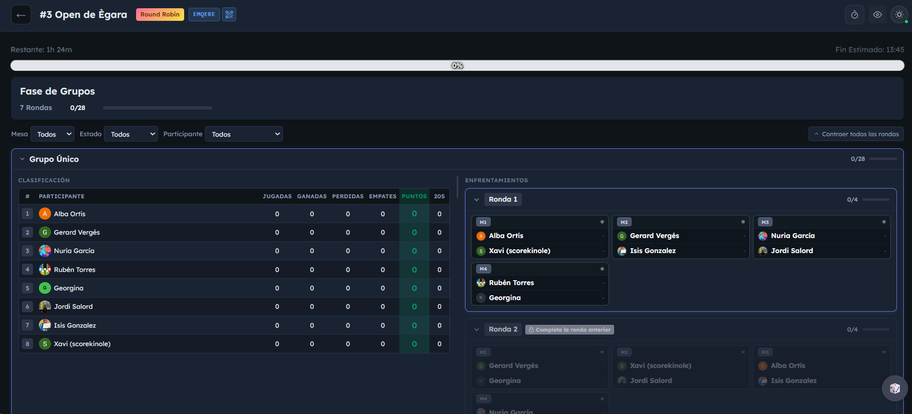
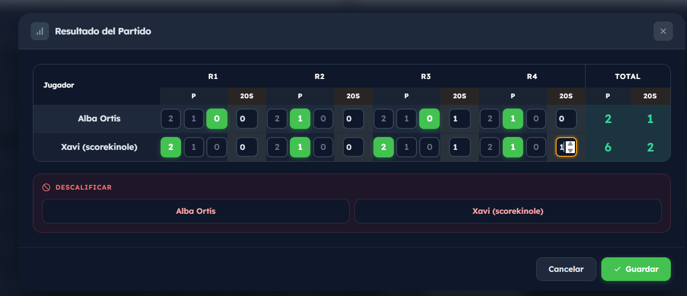
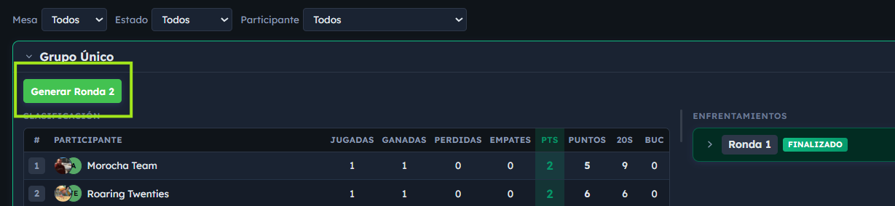
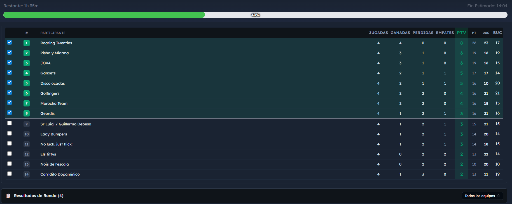
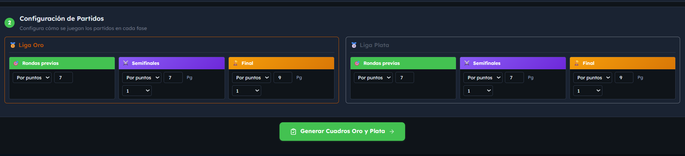
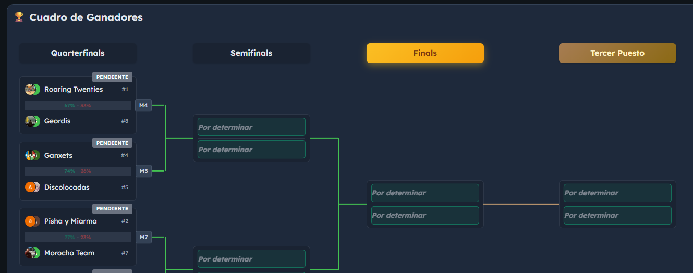
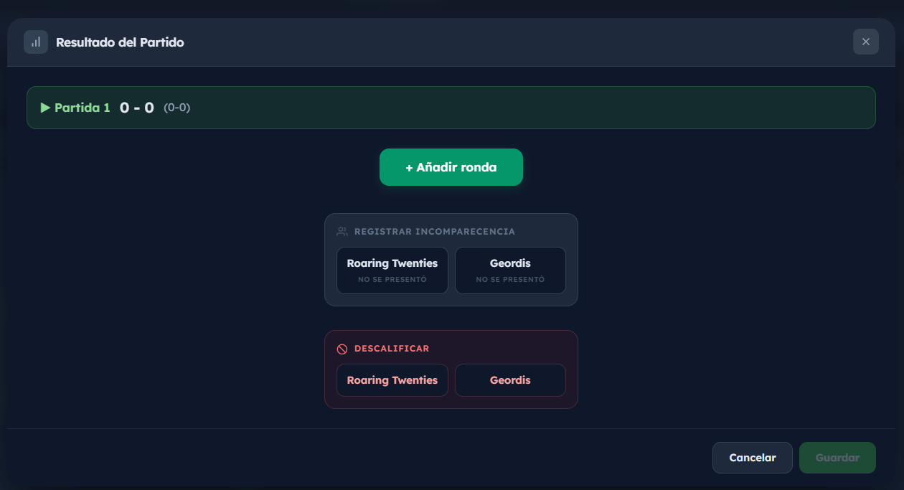
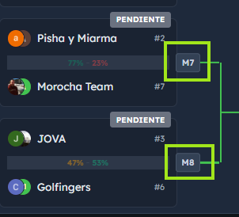
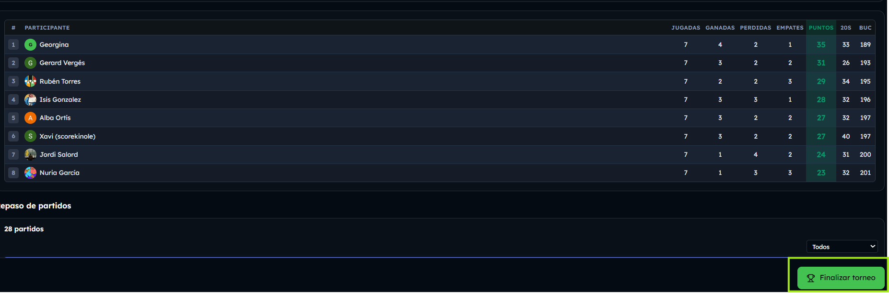

# Gestionar un torneo en directo

Guía paso a paso para administradores **sin conocimientos técnicos** que ya tienen el torneo creado y necesitan **gestionarlo durante el evento**: introducir resultados a mano, elegir quién pasa a la fase final, llevar el cuadro eliminatorio y finalizarlo.

> 💡 Si todavía no has creado el torneo, primero ve a [GUIA_ADMIN_TORNEOS.md](./GUIA_ADMIN_TORNEOS.md). Esta guía empieza desde el momento en que pulsas **"Iniciar torneo"**.

---

## Recordatorio: ciclo de vida del torneo

```
Borrador
   ↓ [Iniciar torneo]
Fase de grupos          ←  📍 Bloque 1 de esta guía
   ↓ [Todos los grupos terminados]
Transición              ←  📍 Bloque 2 de esta guía
   ↓ [Pulsar "Generar cuadro"]
Cuadro final            ←  📍 Bloque 3 de esta guía
   ↓ [Última partida jugada]
Terminado               ←  📍 Bloque 4 de esta guía
```

---

## Bloque 1 — Fase de grupos

> Esta sección **solo aparece si tu torneo tiene fase de grupos** (es decir, "2 fases" o "Solo fase de grupos"). Si elegiste "1 fase", salta directamente al **Bloque 3**.

### Cómo se accede

Desde el panel del torneo (Admin → Torneos → tu torneo), pulsa la pestaña/sección **Grupos**. La URL es `/admin/tournaments/[id]/groups`.



Verás una tabla por cada grupo con sus jugadores y todas las partidas programadas.

### Cómo introducir un resultado a mano

1. **Pulsa sobre la partida** que quieres rellenar (no funciona en partidos BYE).
2. Aparece un **modal** llamado *"Resultado del partido"*. Dependiendo de la configuración del torneo verás:
   - **Ganador**: A, B o "Walkover" (no presentado).
   - **Juegos ganados**: cuántos juegos ha ganado cada jugador (campo obligatorio).
   - **Puntos totales** *(si el modo es "Por puntos")*: la suma de puntos del partido.
   - **20s** *(si "Contar 20s" está activado)*: cuántos 20s ha hecho cada uno.
   - **Detalle de rondas** *(si el modo es "Por rondas")*: puntos por ronda dentro de cada juego.
3. Pulsa **"Guardar"**. La partida se marca como completada en tiempo real para todos los admins conectados.



> 💡 Si te equivocas, vuelve a pulsar la partida y corrige el resultado. Mientras el torneo no esté terminado, puedes editar.

### Round Robin: las rondas se desbloquean solas

En **Round Robin** no tienes que hacer nada para avanzar de ronda. Todos los partidos están **generados desde el principio** (cada uno contra cada uno). En la práctica, en cuanto los jugadores terminan los partidos de una ronda **ya pueden jugar los de la siguiente** — no hay botón "Siguiente ronda".

> 💡 La app organiza el calendario de partidos para que tenga sentido jugarlos en bloques (ronda 1 → ronda 2 → …), pero técnicamente no se bloquean: si dos jugadores terminan pronto su partido de la ronda 1, pueden empezar el de la ronda 2 mientras los demás aún están jugando.

### Suizo: configurar y generar rondas

En **Suizo** funciona distinto: tienes un panel de configuración llamado **"⚙️ Configuración de rondas Suizas"** en la parte superior:

- Te muestra la **ronda actual** (ej: "Ronda 3/5").
- Puedes **cambiar el número total de rondas** si te has quedado corto o sobra.
- Cuando todas las partidas de una ronda están listas, aparece **"Generar siguiente ronda"** — la app crea los emparejamientos automáticamente con el algoritmo Suizo (no es manual).



> ⚠️ El algoritmo Suizo empareja a los jugadores con **puntuación parecida**. Tú no puedes elegir manualmente quién juega contra quién — es una de sus ventajas.

### Cuando termina la fase de grupos

Cuando **todas las rondas de todos los grupos** están completadas, aparecerá uno de estos dos botones:

- **"Pasar a fase final"** — si tu torneo es de "2 fases" → te lleva a la página de Transición (Bloque 2).
- **"Finalizar torneo"** — si elegiste "Solo fase de grupos" → te lleva a la página de Finalizar (Bloque 4).

Antes de avanzar verás un **modal de confirmación** que lista todas las partidas completadas para que las revises.

### Funciones extra disponibles

- **🎲 Autorellenar** *(solo testing — botón flotante con dado)*: rellena todos los pendientes con resultados aleatorios. Muy útil para ensayos. Ver [GUIA_ADMIN_TORNEOS.md](./GUIA_ADMIN_TORNEOS.md#-autorellenar-partidos-auto-fill).
- **No presentado (Walkover)**: desde el modal del resultado puedes marcar a un jugador como ausente. El rival gana 8-0.
- **Descalificar a un jugador (DSQ)**: si un jugador abandona, lo descalificas y la app marca todos sus partidos pendientes como Walkover automáticamente. Ver [ADMIN_TORNEO_FUNCIONES.md](./ADMIN_TORNEO_FUNCIONES.md).

---

## Bloque 2 — Transición a la fase final

> Esta página **solo existe si tu torneo es de "2 fases"** (grupos + cuadro final). Si elegiste "Solo fase de grupos" o "1 fase", esta sección NO aparece.

### Para qué sirve

La página de Transición es donde tú, como admin, decides:

1. **Quiénes pasan al cuadro final** (los clasificados).
2. **Cómo se reparten** entre Cuadro Único o divisiones Oro/Plata.
3. **Cómo serán las eliminatorias** (rondas iniciales, semifinal, final).

URL: `/admin/tournaments/[id]/transition`.

### Cómo se accede

Aparece automáticamente al pulsar **"Pasar a fase final"** desde la fase de grupos. También puedes acceder directamente si el estado del torneo es Transición.

### Paso 1: elegir clasificados

Verás la **clasificación final de cada grupo** (con posiciones, victorias, empates, derrotas, puntos, Buchholz si aplica) y al lado **casillas de selección (checkboxes)** para marcar quién pasa.



> ⚠️ La selección **NO es automática**: tú marcas manualmente. El número total de clasificados debe permitir un cuadro válido (2, 4, 8, 16 o 32). Si no, el botón de generar cuadro estará bloqueado.

#### Empates pendientes (shoot-out)

Si la app detecta empates que no ha podido resolver con los criterios automáticos, verás un **aviso amarillo**: *"Hay empates pendientes de resolver"*. Tienes dos opciones:

- **Recalcular clasificaciones**: la app aplica los criterios de desempate (H2H → 20s → puntos totales → Buchholz). Ver [DESEMPATES.md](./DESEMPATES.md) para entender el orden.
- **Cambiar el orden de criterios**: hay un panel desplegable para reordenar.
- **Shoot-out**: si tras recalcular siguen empatados, la app te muestra los jugadores empatados y puedes reordenarlos manualmente (después de que jueguen el shoot-out físico, ver [DESEMPATES.md](./DESEMPATES.md#empates-sin-resolver-el-shoot-out)).

### Paso 2: divisiones Oro / Plata (si las elegiste)

Si en la creación del torneo activaste **"Oro y Plata"**, en la misma pantalla de la sección anterior verás:

- Un selector **"Top N por grupo"**: indica cuántos clasificados de cada grupo van al cuadro **Oro**. Por defecto la app sugiere un valor razonable (típicamente 8 en total entre todos los grupos), pero puedes cambiarlo.
- **● Oro**: los seleccionados (los mejores de cada grupo, según el Top N).
- **● Plata**: los no clasificados que pasarán al cuadro paralelo.
- La app aplica **cross-seeding**: jugadores de grupos distintos se enfrentan en las primeras rondas (más equilibrado).
- Avisos de **tamaño válido**: si Oro o Plata no tienen un tamaño que dé un cuadro válido (4, 8, 16, 32), no podrás generar el cuadro hasta que ajustes el Top N o las casillas de selección.

Si elegiste **Cuadro único** en vez de Oro/Plata, simplemente verás la lista única de clasificados sin esta distribución.

### Paso 3: configurar las fases del cuadro

Verás 3 secciones de configuración (cada una con sus propias reglas):



| Fase | Qué se configura |
|------|-----------------|
| **Rondas iniciales** *(octavos, cuartos)* | Modo (rondas/puntos) + valor (ej: 4 rondas o 7 puntos). |
| **Semifinales** | Modo + valor + **Best of 1 o 3**. |
| **Final** | Modo + valor + **Best of 1 o 3** (por defecto 9 puntos). |

Si tienes Oro y Plata, verás dos paneles duplicados (típicamente Plata se configura más corto: ej. 4 rondas final en vez de 9 puntos).

### Paso 4: generar el cuadro

Cuando todo esté listo, pulsa el botón grande **"Generar cuadro"**. La app:

1. Valida que cada cuadro tenga un número válido de participantes.
2. Guarda los clasificados en la base de datos.
3. Genera los árboles (Oro y/o Plata) con la configuración que pusiste.
4. Cambia el estado del torneo a **Cuadro final**.
5. Te lleva automáticamente a la página del cuadro (Bloque 3).

Verás un mensaje: *"Cuadro generado. Avanzando…"*.

---

## Bloque 3 — Cuadro final (eliminatorias)

URL: `/admin/tournaments/[id]/bracket`.

### Vista general

Aquí ves el árbol eliminatorio completo. Si tienes Oro/Plata, verás dos pestañas para alternar entre cuadros. Las rondas se muestran de izquierda a derecha (ej: Ronda de 16 → Cuartos → Semifinal → Final).



Si activaste **partido por el 3er puesto**: aparece como una partida aparte entre los perdedores de las semifinales.

Si activaste **cuadro de consolación**: hay sub-secciones extra ("Consolación R16", "Consolación R8"…) con las posiciones finales (5º-6º, 7º-8º, etc.). Los perdedores de rondas iniciales se vuelcan ahí automáticamente.

### Introducir un resultado a mano

Funciona **igual que en la fase de grupos**:

1. Pulsa sobre la partida.
2. Aparece el modal de resultado.
3. Rellena ganador, juegos, puntos, 20s.
4. Pulsa **"Guardar"**.



**Diferencias respecto a grupos**:

- En **Best of 3**, el modal te muestra el marcador acumulado del cruce (ej: "1-1, juega el partido decisivo"). Solo se cierra el cruce cuando un jugador gana 2 juegos.
- Cuando guardas el resultado de un partido, **el ganador avanza automáticamente** a la siguiente ronda del cuadro.
- Las fases se **bloquean (🔒)** cuando empieza la primera partida — ya no puedes cambiar la configuración (Best of, rondas, puntos) de esa fase.

### Asignación de mesas

En la parte superior verás un panel de **Mesas**:



- Muestra el número actual de mesas disponibles (ej: "4").
- Pulsa el número para **editarlo** y pulsa **"✓"** para guardar — la app reasigna automáticamente.
- Pulsa **"⟳ Reasignar mesas"** para redistribuir manualmente sin cambiar el número.
- Cada partida completada muestra en qué mesa se jugó.

> 💡 La app reparte las partidas entre mesas para que se jueguen en paralelo cuando es posible.

### Funciones extra del cuadro

- **🎲 Autorellenar**: rellena todas las partidas pendientes (Oro y Plata) con resultados aleatorios. Solo para testing.
- **🔧 Reparar partidas**: si por algún error un ganador no avanzó correctamente, este botón intenta repararlo.
- **⚙️ Editar configuración**: solo disponible en fases que aún no han empezado.

---

## Bloque 4 — Finalizar el torneo

### Si el torneo es "Solo fase de grupos"

Al terminar todos los grupos, pulsas **"Finalizar torneo"** y vas a `/admin/tournaments/[id]/finalize`. Allí revisas las posiciones finales, resuelves cualquier empate pendiente y confirmas.



### Si el torneo es de "2 fases" o "1 fase"

El torneo se finaliza **solo cuando se juega la última partida del cuadro final**. La app cambia automáticamente el estado a **Terminado**:

- El cuadro muestra una insignia verde **"COMPLETADO"**.
- Los modales de edición se deshabilitan.
- Se ve la **clasificación final**: 1º (campeón), 2º, 3º (si activaste el partido por el 3er puesto), 5º-8º (si activaste consolación), etc.
- Si configuraste el torneo para que **dé puntos al ranking general**, los puntos se reparten automáticamente a los participantes en ese momento.

> 💡 Una vez terminado, los jugadores pueden ver el resultado en la página pública del torneo (`/tournaments/[key]`).

---

## Errores frecuentes y consejos

| Problema | Solución |
|----------|----------|
| "El botón 'Generar cuadro' está deshabilitado" | El número total de clasificados no permite un cuadro válido. Debe ser 2, 4, 8, 16 o 32. Marca/desmarca jugadores hasta que cuadre. |
| "Aparece un aviso amarillo de empates en transición" | Pulsa **"Recalcular clasificaciones"**. Si persiste, los jugadores deben jugar un shoot-out físico y tú reordenarlos manualmente. Ver [DESEMPATES.md](./DESEMPATES.md). |
| "Quiero cambiar el Best of de la final pero no me deja" | La fase ya empezó. Las configuraciones se bloquean al empezar para no romper partidos en curso. |
| "Un jugador ganó pero no avanzó al siguiente cruce" | Pulsa **"🔧 Reparar partidas"** desde la vista del cuadro. |
| "Las mesas no están bien repartidas" | Pulsa **"⟳ Reasignar mesas"** en el panel superior del cuadro. |
| "No quiero pasar a fase final aún, quiero seguir editando grupos" | Mientras no pulses "Pasar a fase final", el torneo sigue en estado Fase de grupos y puedes editar resultados. |
| "El torneo se quedó en 'Transición' y no avanza" | Tienes que pulsar **"Generar cuadro"** desde la página de transición. Si no, el torneo no progresa. |
| "He terminado todos los partidos del cuadro y el torneo no se marca como completado" | Comprueba que has jugado el partido por el 3er puesto (si lo activaste) y el cuadro de consolación (si lo activaste). Todas esas partidas cuentan. |

---

## Resumen rápido (cheat sheet)

```
1. Iniciar torneo            → empieza la fase de grupos
2. Pulsar partida            → modal → rellenar resultado → Guardar
3. Round Robin: las siguientes rondas se desbloquean solas
   Suizo: pulsar "Generar siguiente ronda"
4. Cuando todos los grupos están listos → "Pasar a fase final"
5. Transición:
   • Marcar clasificados (checkbox)
   • Resolver empates si los hay
   • Repartir Oro/Plata si aplica
   • Configurar Best of de cada fase
   • Pulsar "Generar cuadro"
6. Cuadro final:
   • Pulsar partida → rellenar → Guardar
   • Ganador avanza solo
   • Asignar mesas si hace falta
7. Cuando se juega la última partida → torneo Terminado automáticamente
```

---

## Documentación relacionada

- [GUIA_ADMIN_TORNEOS.md](./GUIA_ADMIN_TORNEOS.md) — Cómo crear el torneo desde cero (paso previo a esta guía)
- [ADMIN_TORNEO_FUNCIONES.md](./ADMIN_TORNEO_FUNCIONES.md) — Funciones especiales del admin (WO, DSQ, fin por tiempo, control en vivo)
- [DESEMPATES.md](./DESEMPATES.md) — Cómo se resuelven los empates en la clasificación
- [DOBLES.md](./DOBLES.md) — Particularidades de los torneos de dobles
